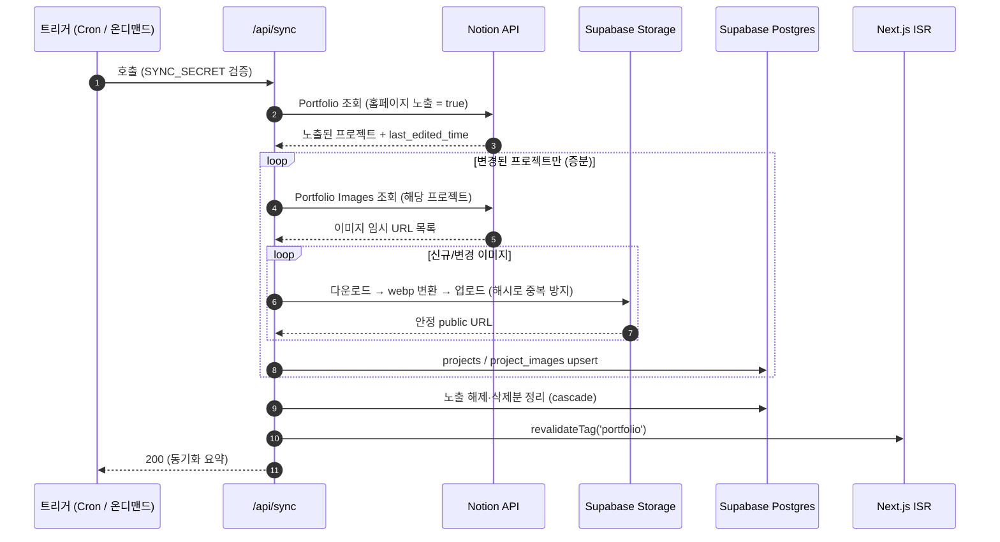
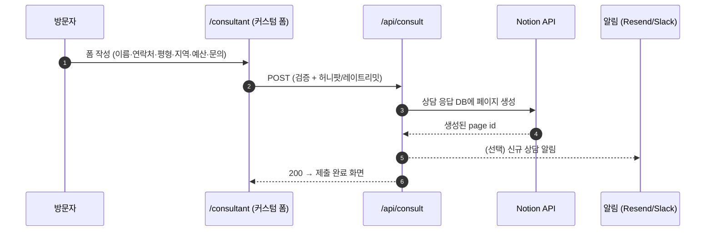
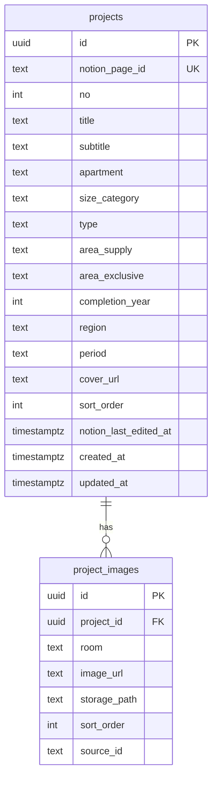

# 아키텍처 — 동기화 파이프라인 & 데이터 모델

Notion(원본) → Supabase(캐시) → Next.js(렌더) 구조와 상담 폼 처리 흐름을 다이어그램으로 정리한다.

---

## 1. 전체 데이터 흐름

```mermaid
flowchart TD
    subgraph Notion["Notion (콘텐츠 원본)"]
        P["Portfolio DB<br/>홈페이지 노출 ✓ 필터"]
        I["Portfolio Images DB<br/>공간별 이미지"]
        C["상담 응답 DB"]
    end

    subgraph Vercel["Next.js on Vercel"]
        SYNC["/api/sync<br/>(동기화 잡)"]
        CONSULT["/api/consult<br/>(상담 폼 처리)"]
        SITE["사이트 페이지<br/>SSG / ISR"]
        CRON["Vercel Cron<br/>(주기 트리거)"]
    end

    subgraph Supabase["Supabase (동기화 캐시)"]
        DB[("Postgres<br/>projects · project_images")]
        STORE[["Storage<br/>portfolio 버킷 (webp)"]]
    end

    CRON -->|주기 호출| SYNC
    NOTIFY["Notion 자동화/버튼<br/>(온디맨드, 시크릿)"] -->|즉시 호출| SYNC

    P -->|노출 ✓ 행만 조회| SYNC
    I -->|이미지 메타 조회| SYNC
    SYNC -->|이미지 다운로드 → webp 변환 → 업로드| STORE
    SYNC -->|메타데이터 upsert / 정리| DB
    SYNC -.->|revalidateTag&#40;'portfolio'&#41;| SITE

    DB -->|읽기 전용| SITE
    STORE -->|이미지 URL| SITE

    USER(("방문자")) -->|포트폴리오 열람| SITE
    USER -->|상담 폼 제출| CONSULT
    CONSULT -->|Notion API로 행 생성| C
    CONSULT -.->|선택| ALERT["메일/슬랙 알림"]
```

- 사이트는 **런타임에 Notion을 호출하지 않는다** → Supabase만 읽어 빠르고 안정적이다.
- Notion 이미지 URL은 약 1시간 후 만료되므로, 동기화 단계에서 **Supabase Storage로 복사**해 만료 없는 URL을 쓴다.

---

## 2. 동기화 잡 시퀀스 (`/api/sync`)

---

## 3. 상담 폼 시퀀스 (`/api/consult`)

---

## 4. Supabase 데이터 모델 (ER)

- Supabase에는 **`홈페이지 노출 ✓` 인 프로젝트만** 존재한다 → 별도 status 컬럼 불필요. 노출 해제 시 동기화 잡이 삭제한다.
- 상담 응답은 Supabase가 아닌 **Notion 응답 DB**에 저장 → `inquiries` 테이블 없음.
- Storage: 버킷 `portfolio`(public), 경로 `projects/{notion_page_id}/{room}/{hash}.webp`.
- RLS: `projects` / `project_images` 는 public read, 쓰기는 서비스 롤(동기화 잡)만.

---

## 5. 렌더링 전략

- **목록 `/portfolio`**: Supabase에서 정적 생성 + ISR. 필터/검색/탭은 쿼리스트링 기반.
- **상세 `/portfolio/[no]`**: `generateStaticParams`를 Supabase에서 생성, 태그 기반 On-Demand ISR로 동기화 후 즉시 갱신.
- **메인 `/`**: 고정 배경 이미지 + 로고 + 버튼(정적). 노션 의존 없음.
- 동기화 잡 완료 시 `revalidateTag('portfolio')`로 목록·상세를 한 번에 무효화.
