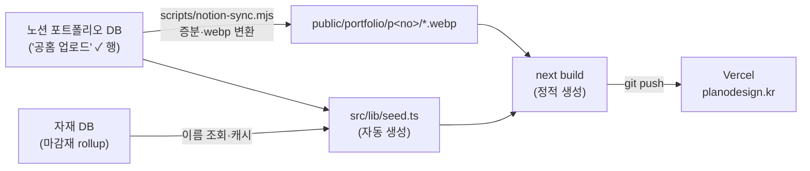

# 아키텍처

사이트는 100% 정적이다. 노션은 **배포 전 동기화 단계에서만** 읽는다.

```mermaid
flowchart LR
    N["노션 포트폴리오 DB<br/>('공홈 업로드' ✓ 행)"] -->|scripts/notion-sync.mjs<br/>증분·webp 변환| P["public/portfolio/p&lt;no&gt;/*.webp"]
    N --> S["src/lib/seed.ts<br/>(자동 생성)"]
    M["자재 DB<br/>(마감재 rollup)"] -->|이름 조회·캐시| S
    P --> B["next build<br/>(정적 생성)"]
    S --> B
    B -->|git push| V["Vercel<br/>planodesign.kr"]
```

## 동기화 규칙

| 항목 | 규칙 |
|---|---|
| 공개 여부 | `공홈 업로드` 체크된 행만. 해제 시 seed·이미지 폴더 제거 |
| 현장 번호 `no` | `scripts/.no-map.json` 에 pageId 별로 고정 → URL 불변 |
| 표시 순서 | `생성 일시` 내림차순(`sortOrder`) |
| 공간 구분 | 페이지 본문의 헤딩(대표/거실/주방/현관/욕실/침실/드레스룸/발코니/서재/복도/기타). `대표` = 목록 카드 커버·호버 |
| 제목 | 노션 페이지 제목 그대로(평형은 `NNpy` 표기) |
| 증분 | `notionLastEditedAt` 이 같으면 이미지 재사용(다운로드 0) |
| 안전장치 | 한 번에 5건 초과 비공개 전환 시 `--yes` 없으면 중단 |

## 상담

사이트에 폼·API 없음. `/consultant` 의 버튼이 노션 폼 링크로 연결된다.
